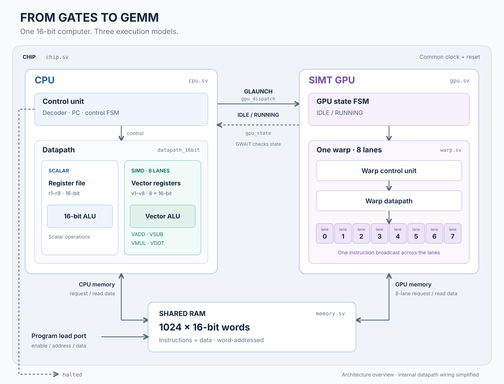
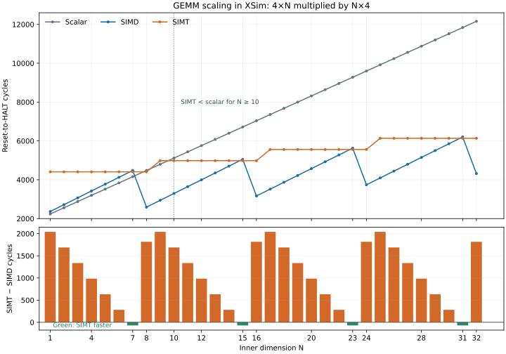

# From Gates to GEMM

From Gates to GEMM builds a small 16-bit computer in SystemVerilog, from logic gates and arithmetic circuits to a scalar CPU, an 8-lane SIMD unit, and a simple SIMT GPU. Basic gates and structural arithmetic primitives are explicit building blocks; the higher-level CPU, vector, GPU, and memory modules are synthesizable SystemVerilog. Assembly programs explore how dot products and matrix multiplication map onto each execution model. The goal is to demystify the path from basic digital logic to the parallel computation underlying modern neural networks, with hardware and programs small enough to follow end to end.

## Execution models at a glance

| Model | Execution | Constraint shown here |
| --- | --- | --- |
| Scalar | One 16-bit scalar instruction and ALU path. | Loops handle one element at a time. |
| SIMD | One CPU vector instruction operates on eight 16-bit lanes; `VLD` and `VST` transfer one lane per memory cycle. | Vector chunks use a scalar tail when needed. |
| SIMT | One instruction stream is broadcast to an eight-lane warp; each lane has its own scalar registers and `TID`. | Control flow must stay uniform; divergent comparisons halt the warp. |

## Verified workloads

`just test-all` assembles and runs the checked-in programs through the
chip-level testbench. The Basys 3 board checks currently cover GEMM programs.

| Program | Chip simulation | Basys 3 hardware |
| --- | --- | --- |
| Scalar dot product | Passed | Not yet run |
| SIMD dot product | Passed | Not yet run |
| SIMT dot product | Passed | Not yet run |
| Scalar GEMM | Passed | Passed |
| SIMD GEMM | Passed | Passed |
| SIMT GEMM | Passed | Passed |

The GEMM simulation compares every output with a Python reference for six
`(M, N, P)` cases: `(3, 4, 2)`, `(4, 4, 4)`, `(2, 5, 3)`, `(2, 9, 2)`,
`(2, 16, 2)`, and `(1, 8, 2)`. These cover SIMD tails and 16-bit wraparound.
Each dot-product implementation is also checked against a Python reference.

Expected values use 16-bit modular arithmetic. The [GEMM reference tests](tests/programs/test_gemm.py)
define the cases and check every output entry.

## Chip architecture



## Simulation

Install Python 3.10+, Icarus Verilog, and `just`, then run:

```sh
just test-all                              # Verify RTL, dot products, and scalar/SIMD/SIMT GEMM.
just test-gemm                             # Reference-check scalar, SIMD, and SIMT GEMM.
just fpga-images                           # Build full RAM images for all GEMM variants.
just fpga-sim                              # Check their FPGA memory path with Vivado Simulator.
just fpga-sweep-sim                        # Sweep GEMM N values and verify outputs in XSim.
just run-program path/to/program.asm       # Assemble and run an arbitrary program.
just clean                                 # Remove generated build artifacts.
```

Simulation output is written beneath `build/sim/`.

## FPGA preparation

`just fpga-images` writes full 1,024-word images for scalar, SIMD, and SIMT
GEMM, plus eight 128-word bank images for each variant. Programs start at word
0, the included input starts at word 100, and C occupies words 116–131. The
adjacent JSON files record the program size and matrix layout.

The board-independent `fpga_gemm_top` takes a `RAM_INIT_PREFIX` such as
`build/fpga/gemm_scalar`. It runs after `reset` is released, raises `halted`,
and exposes all 16 C words through `result_index` and `result_word`. Its banked
memory is specialized for these GEMM programs: GPU writes must target only the
eight lane partials at addresses 108–115. The ordinary `chip` configuration
retains the full shared RAM behavior and its program load port.

### Basys 3 (Artix-7 xc7a35tcpg236-1)

With Vivado on `PATH`, build, program, and check one variant at a time:

```sh
just fpga-build scalar             # Also accepts simd or simt.
just fpga-program scalar
just fpga-check --port /dev/ttyUSB1
just fpga-bench 16                 # Build, program, verify, and compare all three.
```

Set `VIVADO=/path/to/vivado` if it is not on `PATH`. The board wrapper uses the
100 MHz onboard clock, center button for reset, LD0 for `halted`, and the USB
UART transmit pin at 115200 baud. It repeatedly sends lines such as
`@00=0007` through `@0F=0003`, followed by `#CYCLES=XXXXXXXX`. The cycle
count starts when reset releases and freezes when the program halts, so it
excludes UART transmission. At 25 MHz, each cycle is 40 ns. The checker reads
all 16 positions, compares them with a Python reference for the selected data,
and reports cycles and execution time. The bitstream,
resource report, and timing report are written beneath
`build/fpga/basys3/<variant>/`. The build fails if routed setup timing is
negative. A different Artix-7 board needs its own pin constraints and clock
wrapper.

## FPGA benchmarks

**One chip, three GEMM programs.** On the same Basys 3 at `N=16`, SIMD finishes
the 4×16 by 16×4 multiplication in **3,166 cycles (2.22× scalar speedup)**;
SIMT takes **4,983 cycles (1.41×)**. The FPGA logic is the same for all three:
only the preloaded RAM contents change. Each RAM image produces its own
bitstream.

### On the Basys 3

`just fpga-bench 16` builds and programs each variant, then checks all 16
output words over UART against a Python reference. The table gives one
successful capture per variant at 25 MHz. Cycles run from reset release to
`HALT`; programming and UART readback are excluded.

| N | Scalar cycles | SIMD cycles | SIMT cycles | Fastest |
| ---: | ---: | ---: | ---: | --- |
| 15 | — | 5,054 | 4,983 | SIMT by 71 cycles |
| **16** | **7,038** | **3,166** | **4,983** | **SIMD by 1,817 cycles** |
| 31 | — | 6,206 | 6,135 | SIMT by 71 cycles |
| 32 | — | 4,318 | 6,135 | SIMD by 1,817 cycles |
| 111 | 37,438 | 11,966 | 11,895 | SIMT by 71 cycles |

The routed implementation has one resource and timing profile because all
variants load the same RTL with different RAM initial contents:

| Design | LUTs | FFs | Block RAMs | DSP48E1s | Setup WNS |
| --- | ---: | ---: | ---: | ---: | ---: |
| Basys 3 GEMM | 7,386 | 2,451 | 0 | 17 | +8.057 ns |

The RAM maps to distributed LUT memory, which accounts for the zero block RAM
count. The [board measurements](docs/fpga-gemm-hardware.csv) preserve each
recorded cycle count.

### Scaling in XSim

The [N=1–32 sweep](docs/fpga-gemm-sweep-n1-32.csv) runs the FPGA memory path in
Vivado Simulator and checks all 16 outputs at every N for all three programs.
These are cycle-accurate simulations of the same RTL, **not board measurements
at every N**.



SIMT's launch and handshake costs dominate some small cases (`N=1`: 4,407
SIMT versus 2,238 scalar cycles). It briefly leads scalar at `N=8`, trails
again at `N=9`, then stays ahead from `N=10` through `N=32` in this sweep.
For each additional complete eight-element chunk, the steady cost across 16
outputs is 20 cycles per multiply-accumulate for scalar and 4.5 for both SIMD
and SIMT. SIMD's scalar tail costs 22 cycles per extra multiply-accumulate:
at `N=7, 15, 23, 31`, SIMT beats SIMD by 71 cycles, while at aligned
`N=8, 16, 24, 32`, SIMD wins by 1,817. The fixed overhead is spread over more
work as N grows: scalar/SIMD speedup rises from 1.73× at `N=8` to 2.82× at
`N=32`.

The [selected XSim points through N=111](docs/fpga-gemm-sweep-selected-n8-111.csv)
show the tail effect at the memory limit: SIMD rises from 9,502 cycles at
`N=104` to 11,966 at `N=111` (+26%) because the seven extra elements use its
scalar tail. SIMT rises from 11,319 to 11,895 cycles (+5%) and edges SIMD by
71 cycles at `N=111`; the Basys 3 measurements above confirm all three counts
at that point.

To repeat a board point, run `just fpga-bench 16` (or replace `16` with any
`N` from 1 to 111). The optional second argument selects the serial port, for
example `just fpga-bench 16 /dev/ttyUSB0`. To regenerate the sweep, run
`just fpga-sweep-sim --max-n 32 --output docs/fpga-gemm-sweep-n1-32.csv`.
The [full benchmark report](docs/fpga-gemm-benchmark.md) includes the data and
the vector-tail analysis.

## Instruction set at a glance

Programs use eight scalar registers (`r1`–`r8`). SIMD adds eight vector
registers (`v1`–`v8`), each with eight 16-bit lanes.

| Area | Instructions | Purpose |
| --- | --- | --- |
| Scalar compute | `LDI`, `LUI`, `MOV`, `ADD`, `SUB`, `AND`, `OR`, `XOR`, `SHL`, `SHR`, `MUL` | Build values and perform scalar computation. |
| Memory and control | `LOAD`, `STORE`, `CMP`, `JMP`, `JZ`, `JLT`, `JR`, `HALT` | Access word-addressed RAM and implement loops. |
| SIMD | `VLD`, `VST`, `VADD`, `VSUB`, `VMUL`, `VDOT` | Operate on eight lanes and reduce a vector dot product. |
| SIMT GPU | `TID`, `GLAUNCH`, `GWAIT` | Identify a warp lane, launch the GPU kernel, and wait for it. |

## Scope and limitations

- The CPU and GPU share a 1,024-word RAM; programs must keep every access within
  that installed range.
- Scalar arithmetic, multiplication, and `VDOT` retain their low 16 bits.
- The GPU is one eight-lane lockstep warp. Divergent control flow and per-lane
  predication are not supported.
- The six variable-size GEMM cases are RTL simulation checks. The default Basys 3
  hardware check uses the included 4×4 input; `fpga-bench` can use a different
  inner dimension while keeping 16 output words. Both read every C word over UART.
  `just fpga-build` checks target synthesis and timing, and `just fpga-check`
  checks hardware output.

## Inspiration

This project was inspired by George Hotz's
[From the Transistor to the Web Browser](https://github.com/geohot/fromthetransistor),
a first-principles course outline. It follows a narrower path from digital logic
to scalar, SIMD, and SIMT matrix multiplication.
